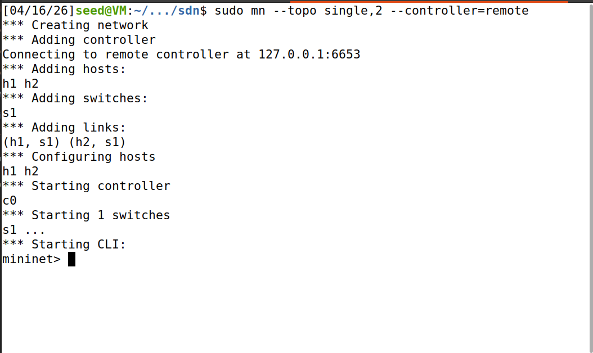
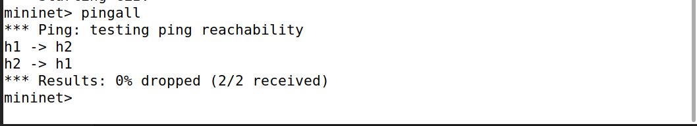
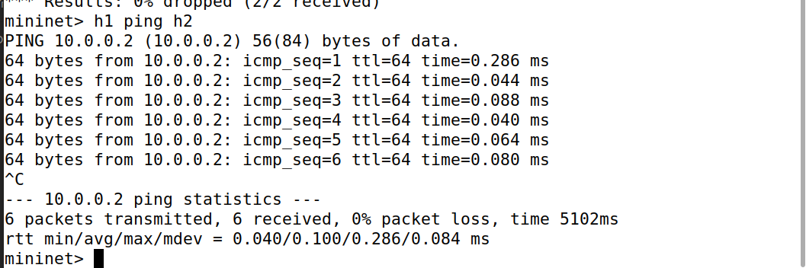
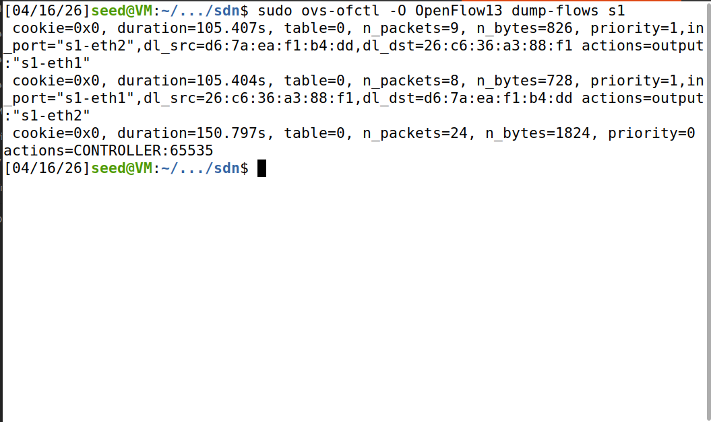
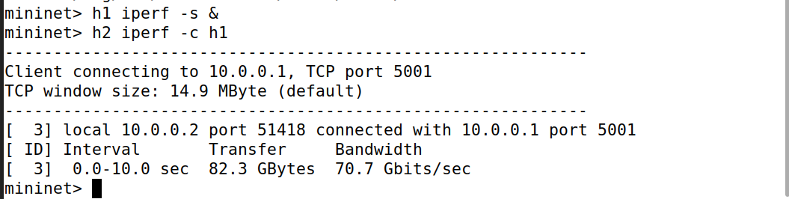

# 🚀 ARP Handling in SDN using Ryu Controller

## 📌 Overview

This project demonstrates how ARP (Address Resolution Protocol) works in a Software Defined Network (SDN) using the Ryu controller. The controller intercepts ARP packets, logs them, and installs flow rules dynamically to enable efficient communication between hosts.

---

## 🎯 Problem Statement

To implement ARP request handling in an SDN environment and analyze how the controller manages packet forwarding using flow rules.

---

## 🛠 Tools & Technologies

* Mininet (Network Emulation)
* Ryu Controller (SDN Controller)
* Open vSwitch
* Ubuntu

---

## 🌐 Network Topology

Single switch topology with multiple hosts connected to a centralized SDN controller.

---

## ⚙️ Setup & Execution Steps

### 1️⃣ Start the Controller

```bash
ryu-manager ryu.app.simple_switch_13
```

### 2️⃣ Start Mininet

```bash
sudo mn --topo single,2 --controller=remote --switch ovsk,protocols=OpenFlow13
```

### 3️⃣ Check Connectivity

```bash
pingall
```

### 4️⃣ Generate Traffic

```bash
h1 ping h2
```

### 5️⃣ View Flow Table

```bash
sudo ovs-ofctl -O OpenFlow13 dump-flows s1
```

### 6️⃣ Measure Throughput

```bash
h1 iperf -s &
h2 iperf -c h1
```

---

## 📊 Expected Output

* Successful communication between hosts (**0% packet loss**)
* Flow rules installed dynamically in switch
* ARP packets handled by controller
* Efficient data transfer using SDN architecture

---

## 📸 Proof of Execution

### 🔹 Network Topology



### 🔹 Connectivity Test



### 🔹 ARP Handling



### 🔹 Flow Table



### 🔹 Throughput Test



---

## 🧠 Working Principle

1. Host sends packet → Switch forwards to controller
2. Controller analyzes packet (ARP detection)
3. Flow rule is installed in switch
4. Future packets are forwarded directly without controller

---

## 📌 Conclusion

This project demonstrates how SDN separates the control plane and data plane, allowing dynamic network management. ARP handling through the controller improves visibility and efficiency of communication.

---

## 👨‍💻 Author

**Pranav S S**

---
